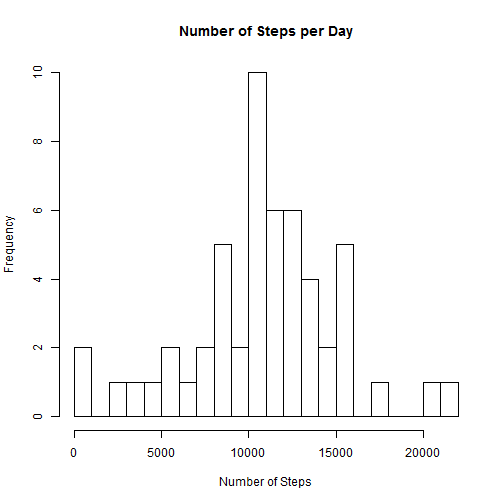
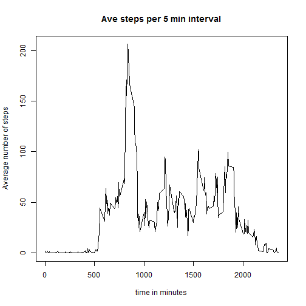
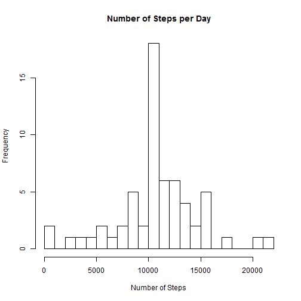
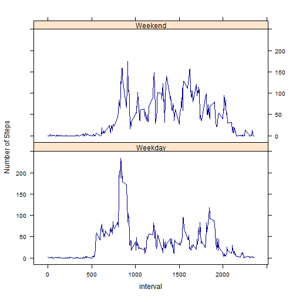

# Reproducible Research: Peer Assessment 1

## Loading and preprocessing the data


```r
options(scipen = 1, digits = 0)
setwd("C:\\Users\\sjelinsky\\Desktop\\Coursera\\Reproducible Research\\")

data<-read.csv("activity.csv", stringsAsFactors=FALSE)
data$date <- as.Date(data$date, format = "%Y-%m-%d")
```

## What is mean total number of steps taken per day? 
 Make a histogram of the total number of steps taken each day

```r
total.steps <- aggregate(steps~date, data=data, FUN=sum, na.rm=TRUE)
hist(total.steps$steps, breaks=25, main="Number of Steps per Day", xlab="Number of Steps")
```

 

 Calculate and report the mean and median total number of steps taken per day


```r
mean.total.steps <- mean(total.steps$steps, na.rm=TRUE)
median.total.steps <- median(total.steps$steps, na.rm=TRUE)
```

The mean number of steps taken per day is **10766** and the median number of steps taken per day is **10765**. 

## What is the average daily activity pattern?
 Make a time series plot (i.e. type = "l") of the 5-minute interval (x-axis) and the average number of steps taken, averaged across all days (y-axis)

```r
total.steps.bytime <- aggregate(steps~interval, data=data, FUN=mean, na.rm=TRUE)
plot(total.steps.bytime, type="l", main = "Ave steps per 5 min interval", 
     xlab = "time in minutes", ylab = "Average number of steps")
```

 

 Which 5-minute interval, on average across all the days in the dataset, contains the maximum number of steps?

```r
max.interval <- total.steps.bytime$interval[which.max(total.steps.bytime$steps)]
# convert to interval to time:
  starttime <- strftime(as.POSIXct( "1970-01-01" ) + as.difftime( max.interval, units="mins"
    ), "%H:%M" )
  endtime <- strftime(as.POSIXct( "1970-01-01" ) + as.difftime( max.interval+ 5, units="mins"
    ), "%H:%M" )
max.interval.time <- paste(starttime, "-", endtime)
```

The 5 minute interval that contains the maximum number of steps is 13:55 - 14:00 

## Inputing missing values
Calculate and report the total number of missing values in the dataset (i.e. the total number of rows with NAs)


```r
totalNA <- sum(as.numeric(is.na(data$steps)))
```
The total number of rows with missing data is 2304

Devise a strategy for filling in all of the missing values in the dataset by replacing missing values based on the average of the interval across all subjects


```r
#calculate the average steps per interval
total.steps.bytime <- aggregate(steps~interval, data=data, FUN=mean, na.rm=TRUE)

replace.steps <- vector()

for (i in 1:nrow(data)){
  if (is.na(data$steps[i])){
    replace.steps <- c(replace.steps, total.steps.bytime$steps[total.steps.bytime$interval == data$interval[i]])
    }
  else {
    replace.steps <- c(replace.steps, data$steps[i])
    }
  }

data.without.missing.data <- data.frame(steps=replace.steps, date=data$date, interval=data$interval)
```

 What is mean total number of steps taken per day? 
 Make a histogram of the total number of steps taken each day using imputted data

```r
total.steps.imputted <- aggregate(steps~date, data=data.without.missing.data, FUN=sum, na.rm=TRUE)
hist(total.steps.imputted$steps, breaks=25, main="Number of Steps per Day", xlab="Number of Steps")
```

 

```r
mean.total.steps.imputted <- mean(total.steps.imputted$steps, na.rm=TRUE)
median.total.steps.imputted <- median(total.steps.imputted$steps, na.rm=TRUE)
```

The mean number of steps taken per day after data imputted is **10766** and the median number of steps taken per day after data imputted is **10766** compared to the mean number of steps **10766** and the median number of steps  **10765** on the unimputted data set. 

## Are there differences in activity patterns between weekdays and weekends?


```r
#adds new column with days of the week
data$day <- weekdays(data$date)
  data$Week <- factor(data$day)
library(plyr)
library(lattice)
  data$Week<-mapvalues(data$Week, from =c("Friday", "Monday", "Saturday", "Sunday", "Thursday", "Tuesday", "Wednesday"), 
            to = c("Weekday", "Weekday", "Weekend", "Weekend", "Weekday", "Weekday", "Weekday"))
#calculate mean steps per interval by Week type
ave.Int.Week <- ddply(data, .(interval, Week), summarise, steps = mean(steps, na.rm=TRUE))
#Plot graphs by Week type
xyplot(steps ~ interval | Week, data = ave.Int.Week, layout = c(1, 2), type="l", par.settings = simpleTheme(col = "Dark blue"),
       ylab = "Number of Steps")
```

 
